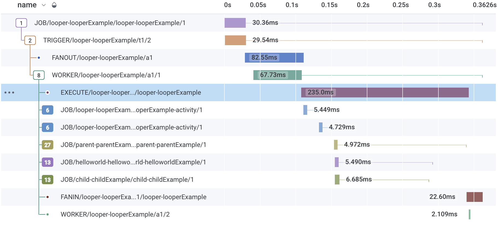
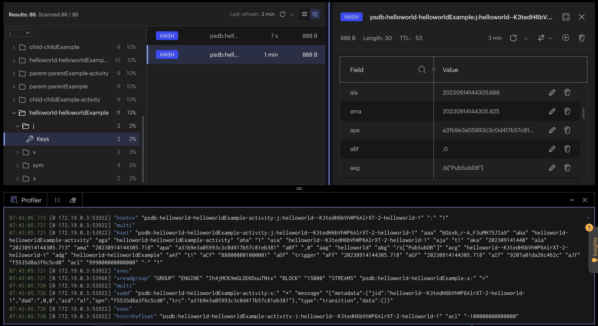

# HotMesh Pluck Dashboard
This repo demonstrates the use of HotMesh in a TypeScript environment. The examples shown are traditional TypeScript functions. But they are run as **reentrant processes** and are executed in a distributed environment, with all the benefits of a distributed system, including fault tolerance, scalability, and high availability.

The optional [HotMesh Dashboard](#visualize--hotmesh-dashboard) can be used to surface the API routes hosted by this demo Express Web App. A few sample entity types are included in the demo, including `User` and `Bill`.

## Build
Deploy the dashboard:

```bash
docker compose up --build -d
```

>The Node instance initializes an Express HTTP server on port `3010` and starts the various workers needed for the demo.

## Run
Open an HTTP test client to invoke the API endpoints for the `User` and `Bill` entities. For example, create a new user by sending a POST request to `http://localhost:3010/api/v1/users` with a JSON payload. A user will be created along with a recurring, transactional bill (a hook) that is designed to execute a bill run every 1 minute.

All HTTP routes are defined in `./web/routes.ts` while business logic for the User and Bill classes is defined in `./services/pluck/user/index.ts` and `./services/pluck/bill/index.ts` respectively.

Use the provided [postman](./postman/) collections to interact with the API endpoints and the Pluck RPC route.

## Telemetry Keys
*Optionally*, add a `.env` file to the project root and include your keys for honeycomb open telemetry if you wish to use the default tracer configuration located in `./services/tracer.ts`. The following keys are required to enable the default tracer in this project (but you can add your own tracer configuration and supporting keys if you use a different OpenTelemetry provider).

```
HONEYCOMB_API_KEY=XXXXXXXXXX
OTEL_SERVICE_NAME=yyyy
```

### Visualize | OpenTelemetry
You will see the full OpenTelemetry execution tree organized as a DAG (if you provided credentials for HoneyComb/etc), allowing you to configure dashboards and alerts as the processes execute.



### Visualize | RedisInsight
You can view the Redis streams and workflow execution by using RedisInsight.



### Visualize | HotMesh Dashboard
The HotMesh React Dashboard (available on request) provides a visual surface for the HotMesh Pluck SDK. It aids in monitoring running workflows, executing aggregation queries and managing the distributed Service Mesh of connected functions.

The RESTful endpoints (`/api/v1/users` and `/api/v1/bills`) provide familiar entry points for managing entities (User and Bill), while the Pluck RPC route (`/api/v1/pluck`) provides an RPC-like interface for conrolling pluck from the Dashboard Web UI.


